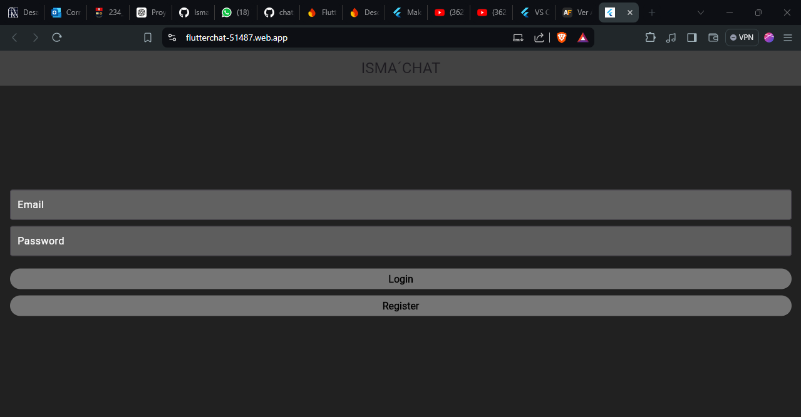
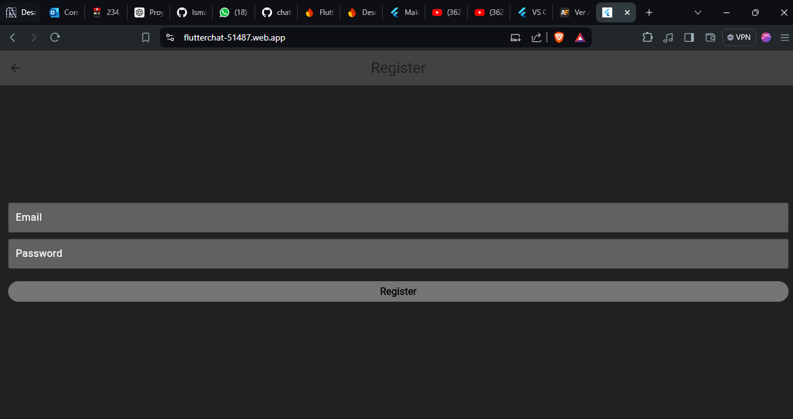
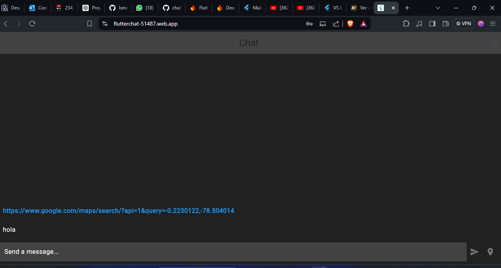

# Evaluación del segundo bimestre
##  CHAT CON UBICACION Y LOGIN 


## Ejecución
* INICIO DE SESION 
<br>



<br>

* REGISTRO DE CUENTA
<br>



<br>

* CHAT VENTANA
<br>



<br>


## Deploy en la web
https://flutterchat-51487.web.app/


## Manual de instalación
Este proyecto fue hecho con Flutter.
Para poder clonar y utilizar este repositorio para ver su funcionamiento o para realizar mejoras, se necesitan las siguientes herramientas:

* Git
* Un editor de texto como Visual Studio Code
* Tener las extenciones de Flutter y dart.

## Instalación
Paso 1: Clonar el repositorio

```
git clone https://github.com/IsmaelNovillo/FlutterChat.git 
```

Paso 2: Instalar dependencias
<br>

```flutter pub get```

Paso 4: Ejecutar el proyecto
<br>

```flutter run```

Paso 5: Escoger uno de los navedadores disponibles (Seleccionar 1,2 o 3):

```
1.- Windows
2.- Chrome
3.- Edge
```
